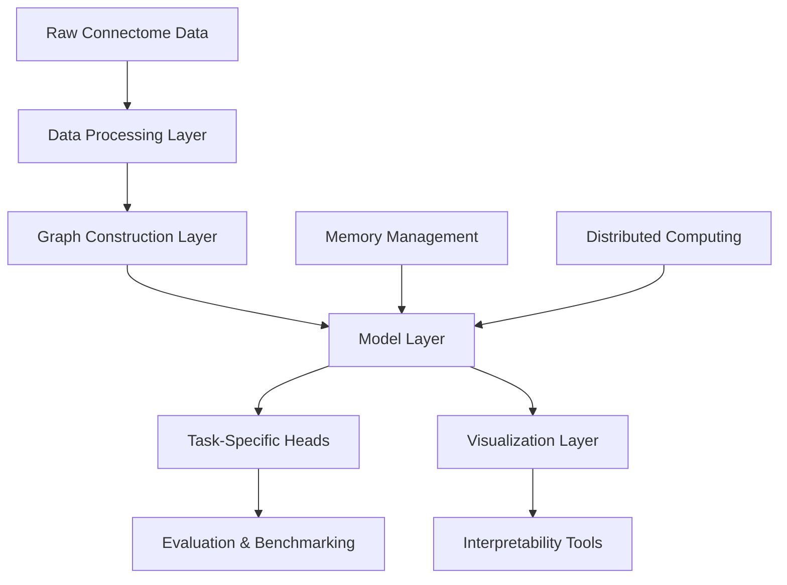

# Architecture Documentation

## System Overview

Connectome-GNN-Suite is a comprehensive graph learning framework designed for large-scale brain connectivity analysis. The system is built on a modular architecture that supports massive-scale connectome processing, hierarchical graph neural networks, and neurologically-informed machine learning.

## High-Level Architecture



## Core Components

### 1. Data Processing Layer (`connectome_gnn/data/`)

**Purpose:** Efficiently handle massive brain connectivity datasets (100B+ edges)

**Key Components:**
- **Loaders:** HCP data ingestion, multi-site harmonization
- **Preprocessing:** Connectivity matrix processing, parcellation handling
- **Atlases:** Brain region definitions and hierarchical structures

**Data Flow:**
```
Raw fMRI/DTI → Connectivity Matrix → Graph Structure → Model Input
```

### 2. Graph Construction Layer

**Purpose:** Convert brain connectivity data into optimized graph representations

**Features:**
- Memory-efficient sparse graph representations
- Hierarchical graph structures respecting brain organization  
- Multi-modal graph fusion (structural + functional connectivity)
- Dynamic graph support for temporal connectivity

### 3. Model Layer (`connectome_gnn/models/`)

**Purpose:** Specialized GNN architectures for brain data

**Architecture Types:**

#### Hierarchical Brain GNN
```python
# Multi-level message passing respecting brain hierarchy
Level 1: Voxel-level processing
Level 2: Region-level aggregation  
Level 3: Network-level integration
Level 4: Global brain representation
```

#### Temporal Connectome GNN
```python
# Dynamic connectivity analysis
Time Series → LSTM Encoder → Graph Attention → Temporal Fusion
```

#### Multi-Modal Brain GNN
```python
# Structural + Functional integration
Structural Graph → GNN Branch 1 ↘
                                  → Fusion Layer → Output
Functional Graph → GNN Branch 2 ↗
```

### 4. Task-Specific Layer (`connectome_gnn/tasks/`)

**Purpose:** Standardized interfaces for common neuroscience prediction tasks

**Task Categories:**
- **Node-level:** Brain region property prediction
- **Edge-level:** Connection strength prediction  
- **Graph-level:** Subject-level phenotype prediction

### 5. Visualization & Interpretability (`connectome_gnn/visualization/`)

**Purpose:** Tools for understanding model behavior and brain representations

**Components:**
- **3D Brain Rendering:** Interactive brain network visualization
- **SubgraphCLIP:** CLIP-based brain region explanation
- **Attention Visualization:** Model attention pattern analysis

## Data Architecture

### Graph Representation

```python
class ConnectomeGraph:
    nodes: Tensor          # [N, node_features] - Brain regions
    edges: Tensor          # [2, E] - Connectivity indices  
    edge_attr: Tensor      # [E, edge_features] - Connection weights
    node_pos: Tensor       # [N, 3] - 3D brain coordinates
    hierarchy: Dict        # Multi-level brain organization
    metadata: Dict         # Subject demographics, scan parameters
```

### Memory Optimization Strategy

**Challenge:** 100B+ edge graphs exceed GPU memory limits

**Solutions:**
1. **Hierarchical Sampling:** Process subgraphs based on brain regions
2. **Gradient Checkpointing:** Trade computation for memory
3. **Mixed Precision:** FP16 training with FP32 stability
4. **Graph Sparsification:** Adaptive edge pruning

## Scalability Architecture

### Distributed Training


### Memory Management

- **Lazy Loading:** Load graph components on-demand
- **Compression:** Efficient storage of sparse connectivity matrices
- **Caching:** Intelligent caching of preprocessed data

## Security Architecture

### Data Privacy
- **Federated Learning:** Train on distributed datasets without data sharing
- **Differential Privacy:** Add noise to protect individual subjects
- **Secure Aggregation:** Combine model updates without exposing raw data

### Model Security  
- **Input Validation:** Sanitize all connectome inputs
- **Model Robustness:** Adversarial training for medical AI safety
- **Audit Logging:** Track all model predictions and data access

## Integration Points

### External Libraries
- **PyTorch Geometric:** Core GNN functionality
- **nibabel:** Neuroimaging data I/O
- **NetworkX:** Graph analysis utilities
- **Plotly/Dash:** Interactive visualizations

### Data Sources
- **Human Connectome Project (HCP):** Primary dataset
- **UK Biobank:** Large-scale population data
- **ADNI:** Alzheimer's disease research data
- **Custom Datasets:** Flexible data ingestion pipeline

## Performance Characteristics

### Scalability Metrics
- **Graph Size:** Up to 100,000 nodes, 100B edges
- **Batch Size:** 8-32 subjects (GPU memory dependent)
- **Training Time:** 2-6 hours on 4x A100 GPUs
- **Memory Usage:** 8-24GB per GPU

### Optimization Strategies
- **Graph Sampling:** Reduce computational complexity
- **Model Distillation:** Create smaller deployment models
- **Quantization:** 8-bit inference for edge deployment

## Deployment Architecture

### Training Environment
```
Training Pipeline:
Data Preprocessing → Model Training → Validation → Hyperparameter Tuning → Model Selection
```

### Inference Environment  
```
Production Pipeline:
Raw Connectome → Preprocessing → Model Inference → Post-processing → Clinical Report
```

### Monitoring & Observability
- **Model Performance:** Prediction accuracy tracking
- **Data Drift:** Connectivity pattern change detection
- **System Health:** GPU utilization, memory usage
- **Clinical Safety:** Prediction confidence thresholds

## Extension Points

### Adding New Models
1. Inherit from `BaseConnectomeModel`
2. Implement required methods: `forward()`, `configure_optimizers()`
3. Register in model factory

### Adding New Tasks
1. Inherit from `BaseConnectomeTask`  
2. Define loss function and evaluation metrics
3. Implement data loading logic

### Adding New Visualizations
1. Inherit from `BaseVisualizer`
2. Implement plotting methods
3. Add interactive components if needed

## Future Architecture Considerations

### Planned Enhancements
- **Multi-Species Support:** Extend to non-human connectomes
- **Real-time Processing:** Stream processing for live fMRI data
- **Cloud Integration:** AWS/GCP deployment pipelines
- **Regulatory Compliance:** FDA/CE marking preparation

### Research Directions
- **Foundation Models:** Pre-trained brain representation models
- **Causal Discovery:** Causal inference in brain networks
- **Federated Learning:** Privacy-preserving multi-site collaboration